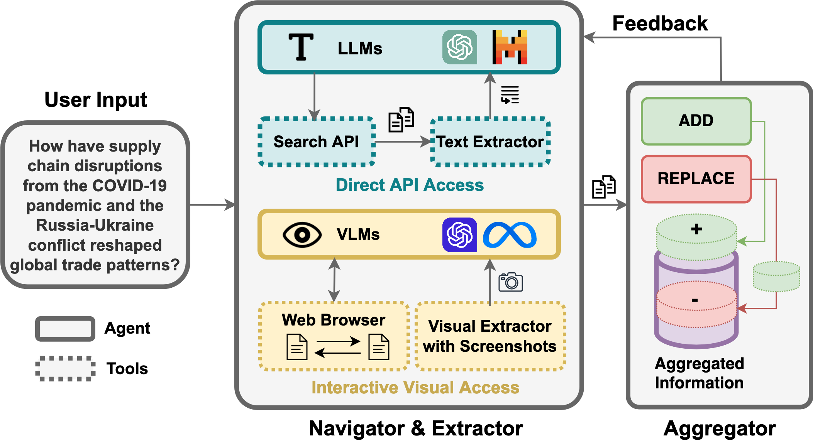

# INFOGENT: An Agent-Based Framework for Web Information Aggregation

INFOGENT is a modular framework designed for web information aggregation. Unlike traditional web agents focused on single-goal navigation, INFOGENT’s unique architecture facilitates complex multi-source data gathering by leveraging autonomous components specialized in navigation, extraction, and aggregation.


## Overview

INFOGENT redefines web navigation for information-seeking tasks. It enables an agent to gather and aggregate information from various sources to answer complex queries. The framework supports both direct API-based access and interactive visual access modes, making it adaptable to a range of information retrieval scenarios. INFOGENT employs a modular, feedback-driven approach to information aggregation, making it suitable for complex queries requiring diverse sources.




- **Navigator**: Conducts web search and identifies relevant websites.
- **Extractor**: Extracts relevant information from the selected web pages.
- **Aggregator**: Aggregates the extracted data and provides feedback to the Navigator.


## Installation

To set up INFOGENT in the interactive visual access setting, clone the repository and install the required dependencies:

```bash
git clone <>
cd infogent/interactive-visual-access
pip install -r requirements.txt
```
Run infogent in the interactive visual access setting with the following command
```bash
python seeact_seeker.py -c config/demo_mode.toml
```

## Installation


If you found this repo useful for your work, please consider citing our paper:
```
@article{reddy2024infogent,
        title={Infogent: An Agent-Based Framework for Web Information Aggregation},
        author={Reddy, Revanth Gangi and Mukherjee, Sagnik and Kim, Jeonghwan and Wang, Zhenhailong and Hakkani-Tur, Dilek and Ji, Heng},
        journal={arXiv preprint arXiv:2410.19054},
        year={2024}
      }
```


